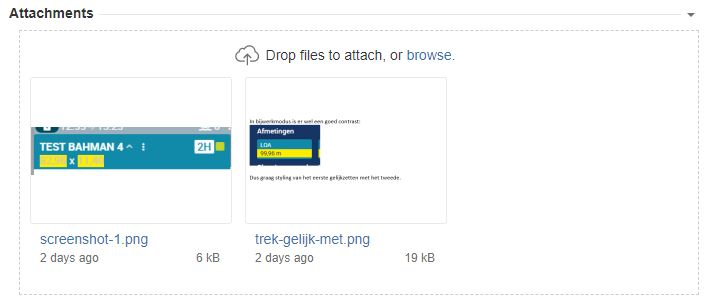

# Next steps?

- Start with the dropzone from:

    > https://bitwiser.in/2015/08/08/creating-dropzone-for-drag-drop-file.html [Done]
    
- Write down features

    - Upload on drop [Done]
        - implement the callbacks in main.ts. [Done]
        - react on it in the dropzone [Done]
        - refactor out the outputElement [Done]
        - refactor the callbacks out, no callbacks in constructor, but real event listener? [Done]
        - add attachment icon, same for all types. [Done]
        - show bytes in kB, MB, ... [Done]
        - make css dragable real BEM -  modifiers [Done]
    - Open file on click [Done]
    - use consts strings or enums for the events. [Done]
    - setDropzoneFiles(dropzoneFiles: DropzoneFile[]): void -> work it out good, 
        cleanup previous elements [Done]
    - updateDropzoneFile(dropzoneFile: DropzoneFile): void -> work it out good [Done]
    - removeDropzoneFile(dropzoneFile: DropzoneFile): void -> work it out good
            cleanup previous elements [Done]
    - Remove eventHandlers when deletable changes from true to false to true. [Done]
    - Remove eventHandlers when downloadable changes from true to false to true. [Done]
    - Add thrashcan icon if deletable. [Done]
        - Make them removable in backend
        - Make them removable in front end [Done] 
        - Keep delete button disabled during delete. [Done]
    - handleUploadCompleted => input dropzoneFile
    - main.ts handle error 
    - backend:
        - catch error in api en send error back.
        - add thumbnail behavious (backend, frontend, output)
    - Configure the removables
    - implement destroy for dropzone, for dropzoneFileElement?
    - multi upload?
    - Populate with read data [Done]
        - Determine data model format [Done]
        - read from backend [Done]
    - Styling: keep the name of the output file element inside the output container.  
    - what to do on click.
        - show image other tab,
        - default behaviour for starting? 
    - show uploading indication
    - show files in JIRA style?  
        - First, without thumbs
        - Second , with thumbs (thumbs are generated in backend? )
    - add disabled/readonly feature
    - fallback for IE11
    - Configure max upload size in frontend
    - configure dropppable, uploadable types?
    - multilanguage support? i18n
    - Upload on client command
    - add CTRL-PASTE behaviour
    - write documentation (jsDoc, tsDoc, readme? for the lib)
    - enable Edge, IE11, Firefox? Safari?
    - build preview library (next lib!)
    - appendDropzoneFile(dropzoneFile: DropzoneFile): void of prepend of insertDropzoneFileAt(dzfile, index)? 
    - getNumberOfDropzoneFiles():number
