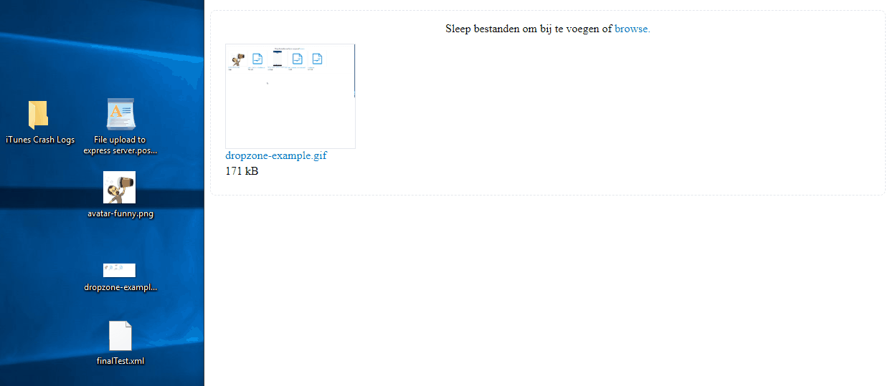

# dropzone-frontend

A html5 - dropzone library.
It can directly be consumed as a typescript library. The current setup needs an scss compilation step. 



## Installation
    npm i dropzone-frontend


## How to use

### TypeScript setup with scss
 
- Include scss in scss file

        @import '../../node_modules/dropzone-frontend/lib/styles/export/dropzone-lib';

- Html file: add a container on your Html file

        <div id="myDropzone">
        </div>
        
- TypeScript file: turn the html-container in a dropzone


````

import {DropzoneFile} from "dropzone-frontend/lib/scripts/model/dropzone-file";
import {Dropzone} from "dropzone-frontend/lib/scripts/dropzone";

const dropzone: Dropzone = new Dropzone(window.document.querySelector('#myDropzone'), {
  uploadProgressLabel: 'upload progress',
  uploadErrorLabel: 'upload error',
  uploadCompleteLabel: 'Upload is compleet',
  browseLabel: 'browse.',
  dropFilesLabel: 'Sleep bestanden om bij te voegen of ',
}); // <-- optionally an i18n - override can be added

// upload the file when it is dropped.
dropzone.addOnFileDroppedEventListener((file: DropzoneFile,
                                        successCallback: (createdDropzoneFile: DropzoneFile) => any | void,
                                        errorCallback: (error?: any) => any,
                                        progress: (uploadPercentage: number) => void) => {
  const formData = new FormData();
  formData.append('file', file.file);

  const xhr = new XMLHttpRequest();
  xhr.addEventListener(
    'progress',
    (e: any) => {
      const done = e.position || e.loaded,
        total = e.totalSize || e.total;
      const percentage = Math.floor((done / total) * 1000) / 10;
      progress(percentage);
    },
    false,
  );

  xhr.onerror = () => {
    errorCallback();
  };
  if (xhr.upload) {
    xhr.upload.onprogress = (e: any) => {
      const done = e.position || e.loaded,
        total = e.totalSize || e.total;
      const percentage = Math.floor((done / total) * 1000) / 10;
      progress(percentage);
    };
  }
  xhr.onreadystatechange = (e: any) => {
    if (xhr.readyState === 4 && xhr.status === 200) {
      file.canBeDeleted = true;
      file.canBeDownloaded = true;
      successCallback(file);
    }
  };
  xhr.open('post', 'http://localhost:3000/api/upload-file', true);
  // xhr.setRequestHeader("Content-Type","multipart/form-data");
  xhr.send(formData);
});

// handle the download file action
dropzone.addDownloadFileEventListener((dropzoneFile: DropzoneFile) => {
  window.open(`http://localhost:3000/api/upload-file/${dropzoneFile.fileName}`);
});

// When the user want's to delete the file, do the delete
dropzone.addOnDeleteFileEventListener((file: DropzoneFile,
                                       successCallback: (deletedFile?: any) => any,
                                       errorCallback: (error?: any) => void) => {
  const formData = new FormData();
  formData.append('file', file.file);
  fetch(`http://localhost:3000/api/upload-file/${file.id}`, {
    method: 'DELETE', // *GET, POST, PUT, DELETE, etc.
    mode: 'cors', // no-cors, cors, *same-origin
    cache: 'no-cache', // *default, no-cache, reload, force-cache, only-if-cached
    credentials: 'same-origin', // include, *same-origin, omit
    //headers: {
    //    'Content-Type': 'multipart/form-data', https://muffinman.io/uploading-files-using-fetch-multipart-form-data/
    //},
    redirect: 'follow', // manual, *follow, error
    referrer: 'no-referrer', // no-referrer, *client
    body: formData, // body data type must match "Content-Type" header
  })
    .then(data => {
      successCallback(data as any);
    }) // JSON-string from `response.json()` call
    .catch(error => {
      errorCallback(error);
    });
});

// load all the files
fetch('http://localhost:3000/api/upload-file', {
  method: 'GET', // *GET, POST, PUT, DELETE, etc.
  mode: 'cors', // no-cors, cors, *same-origin
  cache: 'no-cache', // *default, no-cache, reload, force-cache, only-if-cached
  credentials: 'same-origin', // include, *same-origin, omit
  headers: {
    'Content-Type': 'application/json',
  },
  redirect: 'follow', // manual, *follow, error
  referrer: 'no-referrer', // no-referrer, *client
  body: undefined, // body data type must match "Content-Type" header
})
  .then(data => {
    data.json().then(jsonData => {
      jsonData.forEach((aJson: any) => {
        if (aJson.thumbnail) {
          aJson.thumbnailUrl = 'http://localhost:3000/api/upload-file/' + aJson.thumbnail;
        }
      });
      dropzone.setDropzoneFiles(jsonData); // put the loaded files on the dropzone
    });
  }) // JSON-string from `response.json()` call
  .catch(error => {
    console.error('error during read', error);
  });
```` 